# Diagram: Full A-ERP System

## ASCII Version

```
┌─────────────────────────────────────────────────────────────────────┐
│                        PRESENTATION LAYER                          │
│                                                                     │
│  ┌──────────┐  ┌──────────┐  ┌──────────┐  ┌──────────┐           │
│  │   PMS    │  │   WMS    │  │   HRM    │  │   CRM    │           │
│  │ Projects │  │ Products │  │  Depts   │  │ Contacts │           │
│  │  Tasks   │  │ Devices  │  │Employees │  │  Deals   │           │
│  │  Goals   │  │Suppliers │  │          │  │          │           │
│  │ Timeline │  │Inventory │  │          │  │          │           │
│  │  Board   │  │Warehouse │  │          │  │          │           │
│  └────┬─────┘  └────┬─────┘  └────┬─────┘  └────┬─────┘           │
│       │              │              │              │                 │
│  React 18 + TanStack Query v5 + Zustand + shadcn/ui                │
└───────┼──────────────┼──────────────┼──────────────┼────────────────┘
        │              │              │              │
        ▼              ▼              ▼              ▼
┌─────────────────────────────────────────────────────────────────────┐
│                         API GATEWAY                                 │
│                    FastAPI  /api/v1/...                             │
│                                                                     │
│  /auth  /workspaces  /teams  /notifications  /sse  /agents         │
│  /pms/projects  /pms/tasks  /wms/warehouses  /wms/products  ...    │
│                                                                     │
│  ┌──────────┐  ┌──────────┐  ┌──────────┐                         │
│  │   JWT    │  │   RBAC   │  │   Rate   │                         │
│  │  Auth    │  │  Guards  │  │  Limit   │                         │
│  └──────────┘  └──────────┘  └──────────┘                         │
└───────┬─────────────────────────────────────────────────────────────┘
        │
        ▼
┌─────────────────────────────────────────────────────────────────────┐
│                      CORE ERP SERVICES                              │
│                                                                     │
│  ┌─────────────┐  ┌─────────────┐  ┌─────────────┐  ┌───────────┐ │
│  │     PMS     │  │     WMS     │  │     HRM     │  │    CRM    │ │
│  │  projects   │  │  warehouses │  │ departments │  │ contacts  │ │
│  │  tasks      │  │  products   │  │  employees  │  │  deals    │ │
│  │  sections   │  │  devices    │  │             │  │           │ │
│  │  goals      │  │  suppliers  │  │             │  │           │ │
│  │  custom fld │  │  inventory  │  │             │  │           │ │
│  └─────────────┘  └─────────────┘  └─────────────┘  └───────────┘ │
└───────┬─────────────────────────────────────────────────────────────┘
        │
        ▼
┌─────────────────────────────────────────────────────────────────────┐
│                    AGENT ORCHESTRATION LAYER                        │
│                                                                     │
│  ┌──────────────────────────────────────────────────────────────┐   │
│  │                  Agent Orchestrator                           │   │
│  │  Routes requests → domain agents → cross-module coordination │   │
│  └──────────┬───────────────┬───────────────┬──────────────────┘   │
│             │               │               │                       │
│  ┌──────────▼──┐ ┌─────────▼───┐ ┌─────────▼───┐ ┌────────────┐  │
│  │ PMS Agent   │ │  WMS Agent  │ │  HRM Agent  │ │ CRM Agent  │  │
│  │ Risk Detect │ │ Demand Fcst │ │ Workforce   │ │ Lead Score │  │
│  │ Workload    │ │ Anomaly Det │ │ Attrition   │ │ Rev Fcst   │  │
│  └─────────────┘ └─────────────┘ └─────────────┘ └────────────┘  │
└───────┬─────────────────────────────────────────────────────────────┘
        │
        ▼
┌─────────────────────────────────────────────────────────────────────┐
│                     MCP PROTOCOL LAYER                              │
│                                                                     │
│  ┌───────────┐  ┌───────────┐  ┌───────────┐  ┌────────────────┐  │
│  │ Envelope  │  │ Event Bus │  │  Shared   │  │  Policy &      │  │
│  │ Protocol  │  │ (pub/sub) │  │  Context  │  │  Audit Trail   │  │
│  └───────────┘  └───────────┘  └───────────┘  └────────────────┘  │
│                                                                     │
│  { type: event|command|context, domain: PMS|WMS|HRM|CRM,           │
│    payload: {}, permission_level: read|suggest|action }             │
└───────┬─────────────────────────────────────────────────────────────┘
        │
        ▼
┌─────────────────────────────────────────────────────────────────────┐
│                      DATA & INFRA LAYER                             │
│                                                                     │
│  ┌──────────────┐  ┌──────────┐  ┌──────────┐  ┌───────────────┐  │
│  │ PostgreSQL 15│  │ Redis 7  │  │   SSE    │  │  ARQ Worker   │  │
│  │  + FTS       │  │  Cache   │  │  Broker  │  │  Background   │  │
│  │  + LISTEN/   │  │  Session │  │  Real-   │  │  Jobs         │  │
│  │    NOTIFY    │  │          │  │  time    │  │  (recurring)  │  │
│  └──────────────┘  └──────────┘  └──────────┘  └───────────────┘  │
│                                                                     │
│  Docker Compose  │  Nginx Proxy  │  structlog  │  Alembic         │
└─────────────────────────────────────────────────────────────────────┘
```

## Mermaid Version

```mermaid
graph TB
    subgraph Frontend["Presentation Layer"]
        direction LR
        PMS_UI["PMS<br/>Projects, Tasks<br/>Board, Timeline, Goals"]
        WMS_UI["WMS<br/>Products, Devices<br/>Suppliers, Inventory"]
        HRM_UI["HRM<br/>Departments<br/>Employees"]
        CRM_UI["CRM<br/>Contacts<br/>Deals"]
    end

    subgraph Gateway["API Gateway — FastAPI"]
        direction LR
        AUTH["JWT Auth"]
        RBAC["RBAC Guards"]
        RATE["Rate Limiter"]
        SSE_EP["SSE Endpoint"]
    end

    subgraph Services["Core ERP Modules"]
        direction LR
        PMS_SVC["PMS Service<br/>projects, tasks, sections<br/>goals, custom fields"]
        WMS_SVC["WMS Service<br/>warehouses, products<br/>devices, suppliers, inventory"]
        HRM_SVC["HRM Service<br/>departments<br/>employees"]
        CRM_SVC["CRM Service<br/>contacts<br/>deals"]
    end

    subgraph Agents["Agent Orchestration Layer"]
        ORCH["Agent Orchestrator"]
        PMS_AGT["PMS Agent<br/>Risk Detection<br/>Workload Optimization"]
        WMS_AGT["WMS Agent<br/>Demand Forecast<br/>Anomaly Detection"]
        HRM_AGT["HRM Agent<br/>Workforce Planning<br/>Attrition Risk"]
        CRM_AGT["CRM Agent<br/>Lead Scoring<br/>Revenue Forecast"]
    end

    subgraph MCP["MCP Protocol Layer"]
        ENV["Envelope Protocol"]
        BUS["Event Bus"]
        CTX["Shared Context"]
        POL["Policy & Audit"]
    end

    subgraph Data["Data & Infrastructure"]
        PG["PostgreSQL 15<br/>FTS + LISTEN/NOTIFY"]
        REDIS["Redis 7<br/>Cache + Sessions"]
        ARQ["ARQ Worker<br/>Background Jobs"]
        DOCKER["Docker + Nginx"]
    end

    Frontend -->|REST + SSE| Gateway
    Gateway --> Services
    Services --> Agents
    Agents --> MCP
    Services --> Data
    MCP --> Data

    ORCH --> PMS_AGT
    ORCH --> WMS_AGT
    ORCH --> HRM_AGT
    ORCH --> CRM_AGT
```


